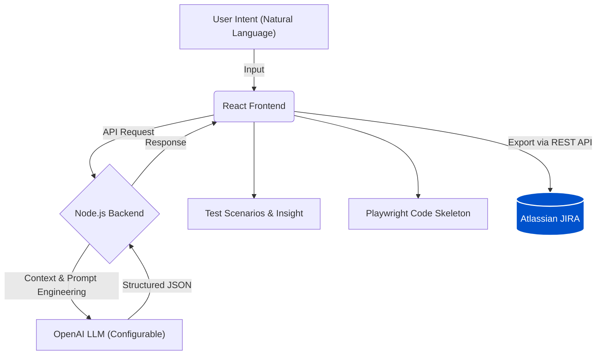
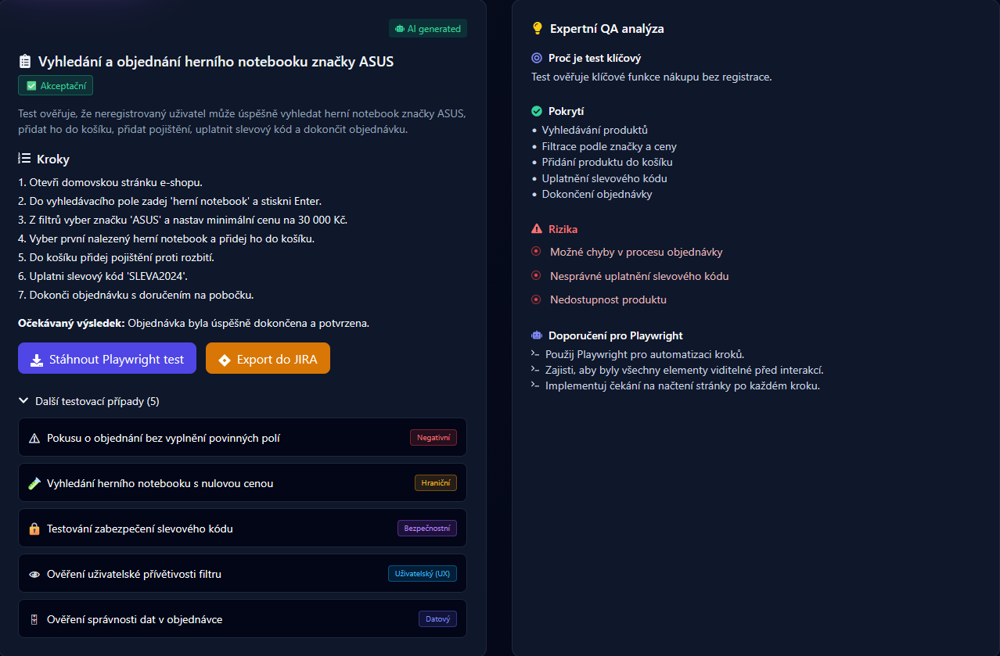
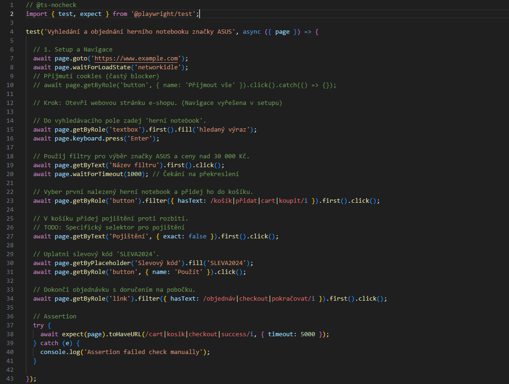
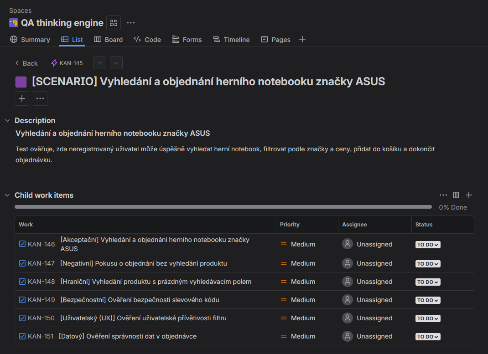

# 🚀 QA Thinking Engine ⚡ (AI-Powered Quality Intelligence)

**Intelligent Tool for Automated QA Strategy & Test Design**

> **From vague intent to Playwright test in 30 seconds.**

[](https://opensource.org/licenses/MIT)


---

## 🧠 About the Project

**QA Thinking Engine** solves the "blank page" problem in software testing. It combines the power of **OpenAI (GPT-4)** with structured QA engineering principles.

Instead of hours spent on manual writing, simply input a **test intent**, and the application acts as a senior architect to generate a complete strategy: from acceptance criteria and edge cases to production-ready automation code.

---

## ⚡ Why This Matters?

Business and development teams often struggle with the "QA bottleneck." Here is how **QA Thinking Engine** compares to the traditional approach:

| Feature | Traditional QA Design | **QA Engine** |
| :--- | :--- | :--- |
| **Design Time** | 2-4 Hours / Sprint | **< 1 Minute** |
| **Risk Identification** | Subjective / Human Error | **Objective / AI-Powered** |
| **Code Output** | Manual implementation | **Instant Playwright Skeleton** |
| **Jira Sync** | Manual ticket creation | **Automatic REST API Export** |

---

## 🛡️ Security-First Approach: Expert QA Insight

Unlike standard LLM prompts, this engine is instructed to look for **OWASP Top 10** vulnerabilities. It specifically flags critical risks to ensure quality from the very first draft:

* **Vulnerability Detection:** Identifies missing validation for SQL Injection, XSS, and Broken Authentication in every test scenario.
* **Strategic Rationale:** Every test is generated with a business context, explaining *why* the test is critical for the product's stability.
* **AI Guardrails:** Uses **Advanced Prompt Chaining** to separate logical analysis from code generation, ensuring high accuracy and preventing AI hallucinations.

---

## 🏗️ High-Level Architecture

The application follows a clean separation of concerns, ensuring modularity between the UI, the logical engine, and the AI integration.



---

## 📸 Application Preview

### 1. 📊 QA Dashboard
*Real-time overview of test coverage, automation status, and recent execution metrics. The dashboard serves as the command center for all QA activities.*


### 2. 🎬 Workflow: Intent to Structure
*Live demonstration of entering a test intent. The engine interprets natural language (Czech) and immediately suggests a test structure.*


### 3. 🧠 AI Analysis & Processing
*Visual feedback while the specialized AI agent analyzes the intent, constructs logic, and identifies potential risks.*


### 4. 📋 Deep Dive: Test Case Detail
*The final output: A structured Acceptance test with distinct steps, preconditions, and a dedicated "Expert QA Insight" panel.*


### 5. 🛠️ Automated Playwright Code
*One-click generation of production-ready Playwright (TypeScript) code skeletons, fully commented and typed.*


### 6. 🎫 JIRA Integration (Proof of Concept)
*Direct integration with Atlassian JIRA. Scenarios can be exported as Tasks/Epics via REST API, bridging the gap between design and management.*


---

## 📦 Output Structure

Unlike generic chat bots, this engine enforces **strict structured outputs** suitable for professional QA workflows.

### 1️⃣ Test Scenarios (The "What" & "Why")
Defines the scope and business goal before jumping into steps.

```json
{
  "id": "SC-01",
  "title": "User Login Validation",
  "goal": "Verify that a registered user can access the account with valid credentials.",
  "risk": "Unauthorized access potential if validation fails."
}
```

### 2️⃣ Test Cases (The "How")
Generates actionable steps for manual or automated execution.

```json
{
  "id": "TC-01",
  "scenarioId": "SC-01",
  "steps": [
    "Navigate to /login page",
    "Enter valid email: user@test.com",
    "Enter valid password",
    "Click 'Login' button"
  ],
  "expectedResult": "User is redirected to Dashboard"
}
```

### 3️⃣ Expert QA Insight
The engine acts as a "second pair of eyes," analyzing coverage and risks.

* **🎯 Strategic Rationale:** Explains the business context and why this specific test is critical for the product.
* **📊 Coverage:** Validates if the test covers "Acceptance flows" or "Negative scenarios".
* **🛡️ Risks:** Identifies edge cases (e.g., SQL Injection, Brute Force).
* **🤖 Automation Tips:** Suggests locators (e.g., `data-testid`) for stability.

---

## ⚙️ Core Capabilities

* 🚀 **Accelerates Test Design:** Reduces planning time by ~80%. Instantly creates comprehensive test plans from a single sentence.
* ⚖️ **Uncovers Hidden Risks:** Identifies edge cases and security vulnerabilities (e.g., SQL Injection) that humans might overlook.
* 🤖 **Instant Automation:** Immediately converts textual test steps into syntactically correct **Playwright (TypeScript)** code.
* 🇨🇿 **Localized Output:** The engine is **optimized for Czech language output** by default (configurable via prompt settings), ensuring consistent documentation.
* 🛡️ **AI Guardrails:** Implements heuristic validators to minimize hallucinations and ensure the generated steps are logically sequential.
* 🎫 **Seamless JIRA Integration:** (Experimental) Prototype feature for exporting scenarios directly to JIRA as Epics/Tasks.

---

## 🛠️ Tech Stack


---

## 🚀 Getting Started

### Prerequisites
* Node.js (v18+)
* NPM or Yarn
* OpenAI API Key
* JIRA API Token (optional, for export features)

### 1. Installation

**Clone the repository and install dependencies:**

```bash
# 1. Clone repo
git clone [https://github.com/mb835/QA-Thinking-Engine.git](https://github.com/mb835/QA-Thinking-Engine.git)
cd QA-Thinking-Engine

# 2. Install Backend dependencies
npm install

# 3. Install Frontend dependencies
cd ui
npm install
```

### 2. Configuration

Return to the root directory, create a `.env` file and update it with your credentials:

```env
# --- OpenAI ---
OPENAI_API_KEY=sk-proj-xxxxxxxx...

# --- JIRA Integration (Optional) ---
JIRA_BASE_URL=[https://your-domain.atlassian.net](https://your-domain.atlassian.net)
JIRA_EMAIL=your-email@example.com
JIRA_API_TOKEN=ATATT3xFfGF0...    # Generate at: [https://id.atlassian.com/manage-profile/security/api-tokens](https://id.atlassian.com/manage-profile/security/api-tokens)
JIRA_PROJECT_KEY=KAN
```

### 3. Run the Application

You need to run Backend and Frontend in separate terminals.

**Terminal 1: Backend (API)**
```bash
# From root directory
npm run dev
# Server starts on http://localhost:3000
```

**Terminal 2: Frontend (UI)**
```bash
# From /ui directory
cd ui
npm run dev
# App starts on http://localhost:5173
```

---

## 🔮 Roadmap & Future Vision

### ✅ Phase 1: Foundation (Implemented)
* [x] **QA Design Engine:** Core Logic & AI Agent for requirement interpretation.
* [x] **Playwright Export:** Automated TypeScript code generation for end-to-end testing.
* [x] **JIRA Integration:** Seamless bridge between AI design and project management.

### 🚀 Phase 2: Intelligence & Stability (Planned)
* [ ] **Privacy-First Masking:** Implementation of PII (Personally Identifiable Information) masking to ensure sensitive data never leaves the local context during AI analysis.
* [ ] **Contextual Awareness:** Integration with Confluence/Documentation to align tests with specific business logic.
* [ ] **Self-Healing Scripts:** AI-driven updates for Playwright locators when the UI changes.
* [ ] **Persistent Storage:** MongoDB integration for saving test history and user preferences.
* [ ] **Risk-Based Heatmaps:** Visual analytics to identify the most vulnerable parts of the application.

### 🛠️ Phase 3: Scaling & Automation (Planned)
* [ ] **CI/CD Pipeline:** GitHub Actions integration for automated test execution.
* [ ] **Synthetic Data Generation:** AI-powered creation of safe, anonymized test data for privacy compliance.
* [ ] **Cloud Testing:** Integration with SauceLabs/BrowserStack for cross-browser validation.
* [ ] **Visual Testing:** Pixel-perfect regression checks using AI computer vision.

---

## 👤 Author

**Martin B.**
* QA Tester | Test Design | API, SQL | AI-Assisted Development
* *This project demonstrates the intersection of QA methodology, AI Engineering, and Software Development.*
